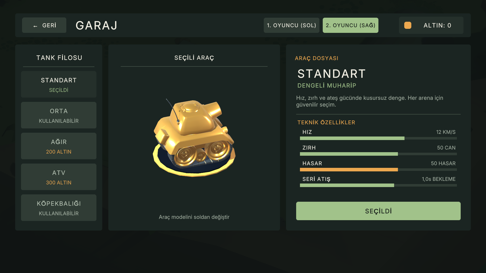
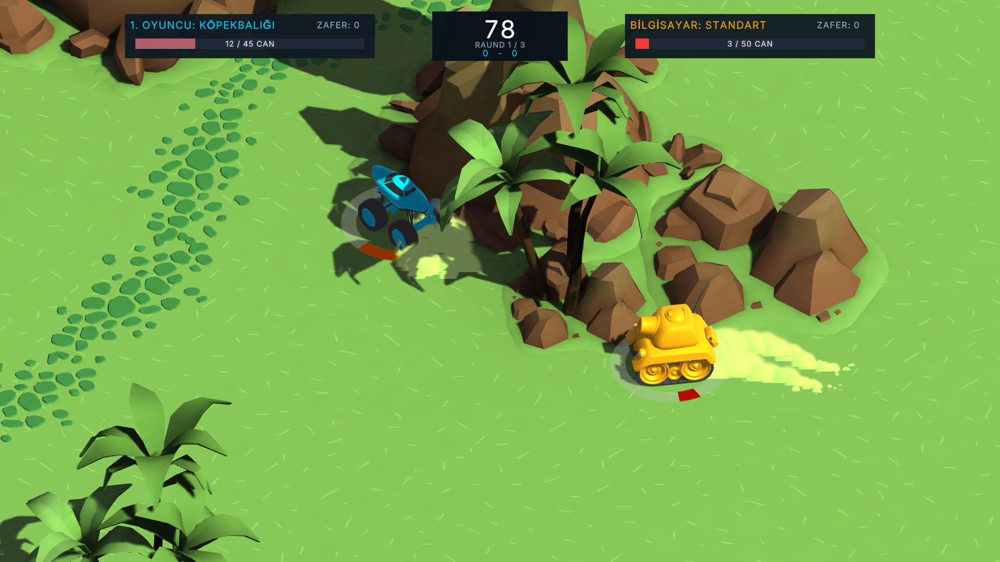
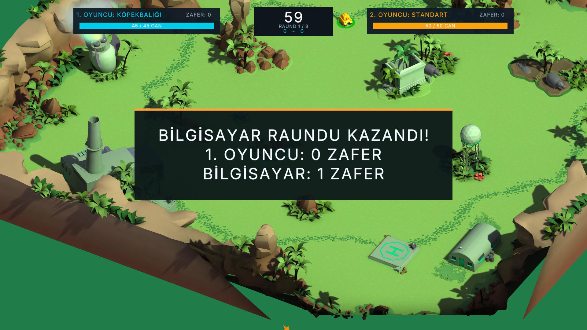

# Tank Düellosu

Tank Düellosu, aynı bilgisayarda iki kişiyle veya bilgisayara karşı oynanan bir tank savaş oyunudur. Orman, çöl ve ay üssü arenaları; beş farklı tank; garaj, altın ve güçlendirmeler içerir.

## Oyuna başla

Windows sürümünü indirdikten sonra **Build klasörünü bir bütün olarak** saklayın ve `Build/TankDuel.exe` dosyasını çalıştırın. Yalnızca `.exe` dosyasını ayırırsanız oyun açılmaz. Ekran ve grafik seçeneklerini oyun içindeki **Ayarlar** bölümünden değiştirebilirsiniz.

## Kontroller

| İşlem | 1. oyuncu | 2. oyuncu |
| --- | --- | --- |
| Tankı sür ve döndür | W, A, S, D | Yön tuşları |
| Ateş et | Boşluk | Enter |
| Duraklat / devam et | Esc | Esc |

Ateş tuşunu basılı tutarak atışı güçlendirebilirsiniz. Tek oyunculu modda ikinci tankı bilgisayar yönetir. Kolay zorlukta standart, orta zorlukta orta, zor zorlukta ağır tank kullanır. İki oyunculu modda ikinci oyuncu da garajdan tank seçebilir. Garajdaki satın alımlar altınla yapılır ve seçimler kaydedilir.

## Ekranlar

| Garaj | Ayarlar |
| --- | --- |
|  |  |

Maç sırasında kamera hareketi takip eder; tek oyunculu modda oyuncu tankına ağırlık verirken rakibi de kadrajda tutar. Raunt duyuruları, arka plandan ayrılan bir panelde gösterilir.

## Geliştirme ve lisans

Proje Unity **6000.6.4f1** ile geliştirilmiştir. Bu herkese açık depoda oyunun Windows sürümü, özgün menü ve oyun yönetimi kodları, ayarlar ve ekran görüntüleri bulunur. Projede kullanılan **Tanks!** içeriğinin ham varlıkları ve bu içeriğe dayanan sahneler, Unity Asset Store lisansı nedeniyle depoya konmamıştır. Bu nedenle depodaki kaynaklar tek başına yeniden derlenebilir tam bir Unity projesi değildir. Geliştirme için ilgili Tanks! içeriğini kendi lisansınızla edinmeniz ve yerel proje dosyalarına eklemeniz gerekir.

Depodaki MIT lisansı yalnızca bu projeye ait özgün kaynaklar için geçerlidir; Tanks! varlıklarının veya diğer üçüncü taraf içeriklerin lisansını değiştirmez. Üçüncü taraf lisans bilgileri yerel Unity projesindeki `Assets/_Tanks/Tanks!_Third-PartyNotice.txt` dosyasında bulunur.
