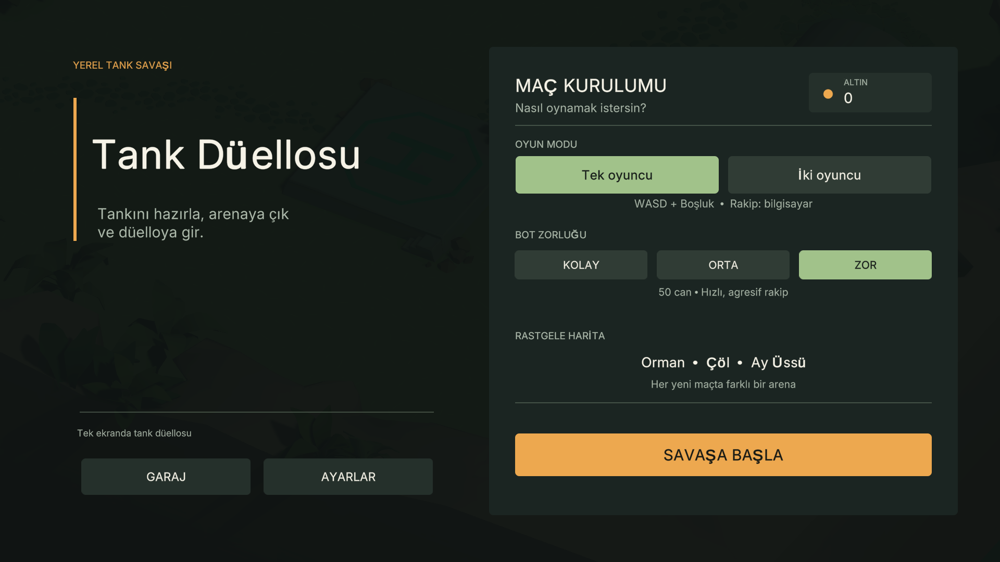
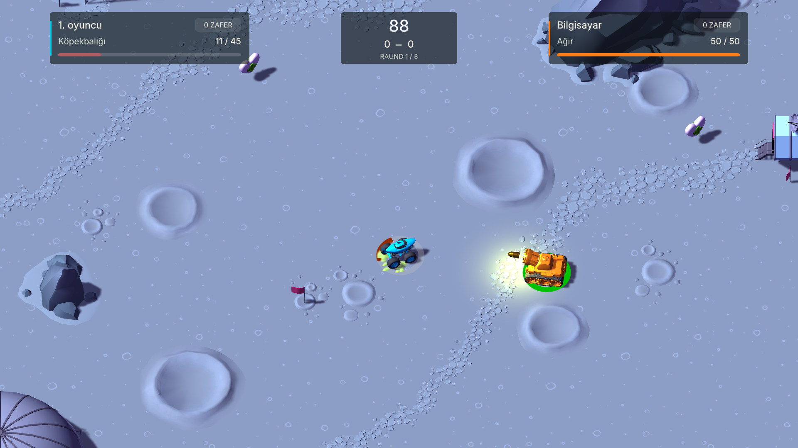
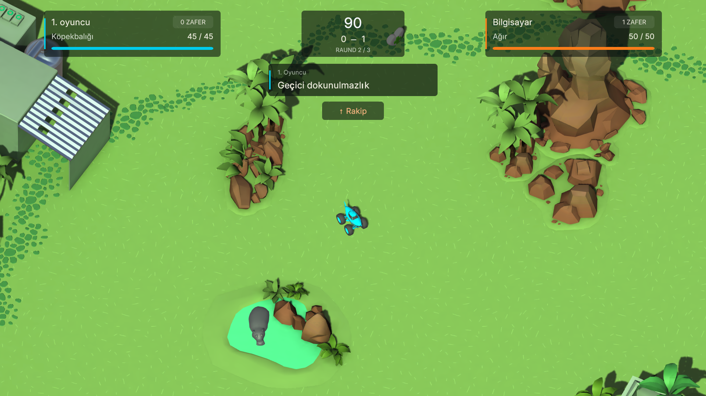
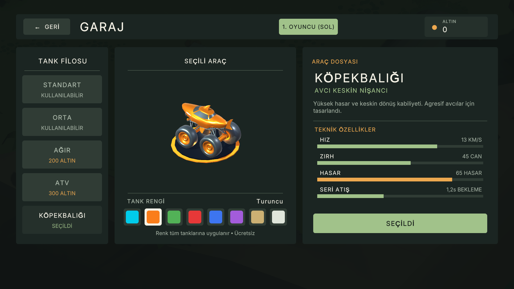
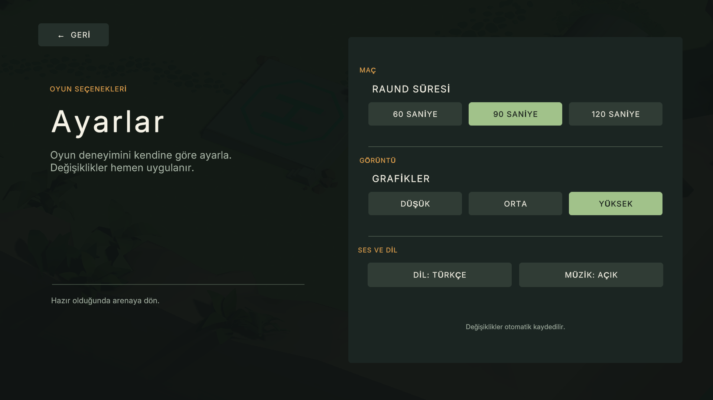

# Tank Düellosu

Tank Düellosu, aynı bilgisayarda iki kişiyle veya bilgisayara karşı oynanan bir tank savaş oyunudur. Üç arena, beş tank, garaj, altın ve güçlendirmeler içerir.

## İndir ve oyna

1. [Releases bölümünden](https://github.com/iambatuw/tank-fight/releases) **TankDuellosu-Windows.zip** dosyasını indirin.
2. ZIP dosyasının tamamını bir klasöre çıkartın.
3. **Oyunu Başlat.cmd** dosyasına çift tıklayın. Doğrudan `Build/TankDuel.exe` dosyasını da açabilirsiniz.

Windows 10/11, 64 bit bilgisayarda oynanır. Unity kurulumu gerekmez. EXE, yanındaki `TankDuel_Data`, `UnityPlayer.dll` ve diğer oyun dosyalarıyla birlikte çalışır. Releases içindeki ayrı EXE, mevcut `Build/TankDuel.exe` dosyasını güncellemek içindir; ilk indirmede ZIP paketini kullanın.

Depoyu **Code → Download ZIP** ile indirirseniz de ana klasördeki **Oyunu Başlat.cmd** dosyasından oynayabilirsiniz.

## Kontroller

| İşlem | 1. oyuncu | 2. oyuncu |
| --- | --- | --- |
| Tankı sür ve döndür | W, A, S, D | Yön tuşları |
| Ateş et | Boşluk | Enter |
| Duraklat / devam et | Esc | Esc |

Ateş tuşunu basılı tutarak atışı güçlendirebilirsiniz. Garajdan tank seçilir ve satın alımlar altınla yapılır. İki oyunculu modda iki taraf da kendi tankını seçebilir.

Garajdaki **Tank rengi** bölümünden turkuaz, turuncu, yeşil, kırmızı, mavi, mor, kum veya beyaz seçebilirsiniz. Renkler ücretsizdir; seçim otomatik kaydedilir ve tüm tanklarınıza uygulanır. İki oyunculu modda her oyuncunun rengi ayrı kaydedilir.

## Rastgele arenalar

Hem iki kişilik düellolarda hem bilgisayara karşı maçlarda **Orman, Çöl ve Ay Üssü** arasından rastgele arena seçilir. Her yeni maçta ve **Yeniden oyna** seçiminde harita değişir; aynı arena art arda gelmez. Bir maçın rauntları aynı arenada oynanır.

Oyun içindeki yarı şeffaf göstergeler oyuncu adını, tank modelini, canı ve skoru ayrı alanlarda gösterir. Renk şeritleri garajda seçtiğiniz tank rengiyle eşleşir.

Harita yalnızca ana menüde **Savaşa başla** veya maç sonunda **Yeniden oyna** seçildiğinde belirlenir. Hızlı tekrar tıklamalar ek yükleme başlatmaz; oyun sırasında ateş ve yön tuşları menü komutlarını çalıştırmaz.

## Bilgisayara karşı

| Zorluk | Rakip tank | Can |
| --- | --- | --- |
| Kolay | Standart | 35 |
| Orta | Orta | 45 |
| Zor | Ağır | 50 |

Bot tankı zorluğa göre seçilir. Bot için garajdan alışveriş yapılmaz. Zorluk arttıkça hareket ve nişan alma davranışı güçlenir.

Botlar da haritadaki güçlendirmeleri toplar: hız, kalkan, seri atış, iyileştirme, geçici dokunulmazlık ve güçlü mermi. Yakındaki ulaşılabilir güçlendirmelere yönelir; canları azaldığında iyileştirmeye öncelik verir. İyileştirme tabloda belirtilen azami canı aşmaz. Oyuncu ve bot aynı anda tek güçlendirme kullanabilir.

## Kamera ve vuruşlar

Tek oyunculu modda kamera oyuncunun tankını yakından takip eder. Ekran dışındaki rakibin yönü kenarda gösterilir. İki oyunculu modda iki tank birlikte kadraja alınır.

| Doğrudan vuruş | Hasar çarpanı |
| --- | --- |
| Ön zırh | ×0,75 |
| Yan gövde | ×1,00 |
| Arka gövde | ×1,50 |

Yakındaki patlama hasarı mesafeyle azalır. Kalkan ve geçici dokunulmazlık ayrıca geçerlidir.

Güçlendirmeler küçük, yarı şeffaf bir bildirimle gösterilir. Rakip yön işareti bildirim alanının dışında kalır ve raunt aralarında gizlenir.

## Garaj ve ayarlar

| Garaj | Ayarlar |
| --- | --- |
|  |  |

## Unity projesini aç

Proje Unity **6000.6.4f1** ile geliştirilmiştir. Sahneler, modeller, oyun kodları ve proje ayarları depoda bulunur.

Releases bölümündeki **TankDuellosu-Unity-Projesi.zip**, düzenlenebilir Unity kaynak paketidir. Hazır oyunu çalıştırmak için **TankDuellosu-Windows.zip** dosyasını kullanın.

1. Depoyu indirin ve ZIP dosyasını çıkartın.
2. Unity Hub üzerinden çıkartılan ana klasörü proje olarak ekleyin.
3. Unity **6000.6.4f1** ile açın; ilk açılışta paketlerin yüklenmesini bekleyin.
4. `Assets/Scenes/Duel_Jungle.unity` sahnesini açıp **Play** düğmesine basın.

Diğer sahneler `Duel_Desert` ve `Duel_Moon` arenalarıdır. Windows oyunu oluşturmak için Unity kurulumunda Windows Build Support bulunmalıdır.

## Dosyalar

| Klasör | İçerik |
| --- | --- |
| `Build` | Windows oyunu |
| `Assets/Scenes` | Üç oynanabilir arena |
| `Assets/Scripts` | Menü, kamera, rakip göstergesi ve oyun yönetimi |
| `Assets/_Tanks` | Tanklar, haritalar, sesler ve temel oyun bileşenleri |
| `Assets/Editor` | Sahne hazırlama ve derleme araçları |
| `ProjectSettings`, `Packages` | Unity proje ve paket ayarları |
| `UI-Preview` | Güncel ekran görüntüleri |
